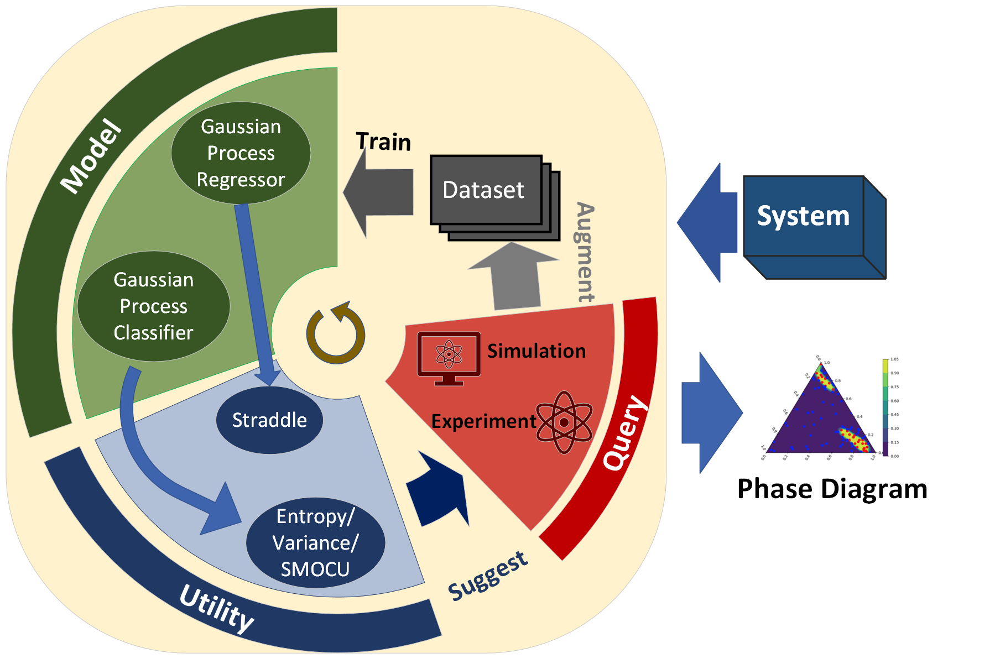

# BALPI
The repository for implementation of BALPI framework

This work proposes a new framework for phase identification tasks with BAL. 

We formulate the phase identification task as two different styles: 
classification and level-set estimation 
by considering the target label as classes or utilizing scores to indicate the phases, respectively. 

For the predictive models, we consider Gaussian Process Classifier (GPC) and Gaussian Process Regressor (GPR) respectively. We also consider different utility functions for the classification formulation and use Straddle (termed as UCB in code) to guide sample selection for the level-set estimation formulation

The code can be found in the folder `code` and we prepared two example data in the folder `data` for the regression data and the classification data,respectively.

Please check the `main.py` file for an examplar runable code.

For the required packages, please see the `requirement.txt` for the prerequisite packages or simply use 
>pip install requirements.txt