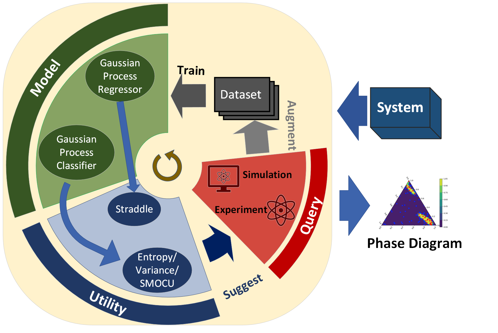

# BALPI

This repository contains an implementation of **BALPI**, a Bayesian active
learning framework for phase identification and phase-diagram exploration.

BALPI studies phase identification under two related formulations:

- **Classification**, where the target is represented as a discrete phase label.
- **Level-set estimation / regression**, where a continuous phase score or phase
  fraction is queried and a phase boundary is recovered by thresholding.

The implementation uses Gaussian-process surrogate models and acquisition
utilities to adaptively select new compositions to query.



## Paper

This code accompanies:

**Bayesian Active Learning to Accelerate High Throughput Phase Diagram
Exploration**

If you use this repository, please cite the paper:

```bibtex
@article{fan2026balpi,
  title={Bayesian Active Learning to Accelerate High Throughput Phase Diagram Exploration},
  author={Fan, Mingzhou and Wang, Yucheng and Vazquez, Guillermo and Zhou, Ruida and Karaman, Ibrahim and Arroyave, Raymundo and Qian, Xiaoning},
  year={2026}
}
```

## Repository Contents

```text
BALPI/
+-- code/
|   +-- dataset.py
|   +-- experiment.py
|   +-- main.py
|   +-- optimization.py
|   +-- surrogate.py
|   +-- util.py
|   +-- utilityfunction.py
+-- data/
|   +-- toy_data.csv
|   +-- toy_data_regression.csv
+-- Flow_Chart.png
+-- LICENSE
+-- README.md
+-- pyproject.toml
+-- requirements.txt
```

The main code components are:

- `dataset.py`: CSV-backed data interface and toy data utilities.
- `surrogate.py`: Gaussian-process classifier/regressor and baseline models.
- `utilityfunction.py`: acquisition functions, including MES, BALD, SMOCU, and
  straddle/UCB-style utilities.
- `optimization.py`: Monte Carlo acquisition maximization.
- `experiment.py`: active-learning experiment classes.
- `main.py`: example regression / level-set active-learning run.

## Data

The bundled `data/` directory contains the BCC-B2 NiTiHfCu pseudo-ternary data
used for the target maps in Figure 4(a-b) of the paper.

- `data/toy_data_regression.csv` contains a continuous BCC-B2 phase score /
  phase-fraction map. This corresponds to Figure 4(a).
- `data/toy_data.csv` contains the corresponding binary BCC-B2 classification
  map. It is obtained by thresholding `toy_data_regression.csv` at `0.8`, and
  corresponds to Figure 4(b).

Both CSV files use the same format:

```text
x1,x2,x3,target
```

where `x1`, `x2`, and `x3` are ternary composition coordinates satisfying
`x1 + x2 + x3 = 1`, and `target` is either a continuous score or a binary label.

The Figure 3 data are not redistributed in this repository. The source data for
the SiO2-Al2O3-MgO glass-ceramic phase-identification example can be found in:

> M. Lesniak, J. Partyka, K. Pasiut, M. Sitarz, Microstructure study of opaque
> glazes from SiO2-Al2O3-MgO-K2O-Na2O system by variable molar ratio of
> SiO2/Al2O3 by FTIR and Raman spectroscopy, Journal of Molecular Structure
> 1126 (2016) 240-250.

## Installation

The project was developed against older scientific Python packages. A Python
3.8 environment is recommended.

Using `venv`:

```bash
python3.8 -m venv .venv
source .venv/bin/activate
pip install --upgrade pip setuptools wheel
pip install -r requirements.txt
```

Using conda:

```bash
conda create -n balpi python=3.8
conda activate balpi
pip install --upgrade pip setuptools wheel
pip install -r requirements.txt
```

## Running the Example

From the repository root:

```bash
python code/main.py
```

The example in `main.py`:

- loads `data/toy_data_regression.csv`,
- initializes a Gaussian-process regression active-learning experiment,
- uses a straddle/UCB-style acquisition utility,
- runs repeated active-learning iterations, and
- writes outputs to a directory named like `results_BCC_20/`.

By default, `main.py` uses:

- `init = 20` initial samples,
- `iters = 80` active-learning iterations,
- 10 repeated runs,
- `utilityfunction.U_UCBS(x, model, .8, .5)`, and
- the threshold `0.8` for identifying the BCC-B2 region.

This run can be computationally expensive because it repeatedly retrains
Gaussian-process models. For a quick smoke test, reduce `init`, `iters`, the
outer repeat loop, or the Monte Carlo search size in `main.py`.

## License

See `LICENSE`.
